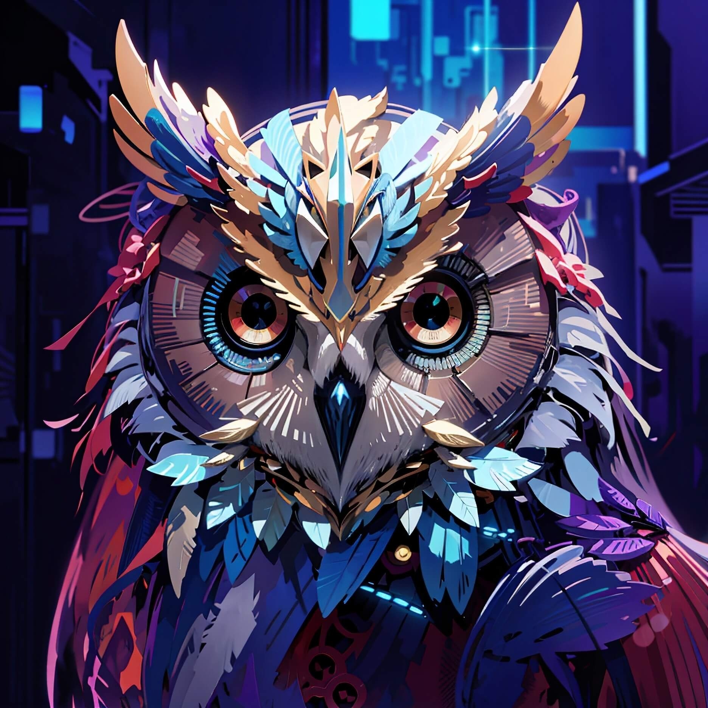

# ArquimedesAI: An Advanced LLM-Powered Chatbot Solution

<p align="center">
  
</p>

Welcome to ArquimedesAI V0.2! This version marks a significant upgrade, transforming ArquimedesAI into a state-of-the-art chatbot powered by a Large Language Model (LLM) and integrated with Discord. Leveraging advanced NLP technologies, ArquimedesAI offers rich, context-aware interactions and can be run locally on a user's PC.

## Features
- **LangChain Framework Integration**: Incorporates the powerful LangChain framework for sophisticated language understanding and generation.
- **RAG-Ready**: Utilizes Retrieval Augmented Generation (RAG) for enhanced response accuracy and relevance.
- **Advanced Embeddings**: Employs a sentence-transformers model to convert text into embedding vectors, stored efficiently in a FAISS database.
- **Powered by Mistral 7b LLM**: Leverages the capabilities of Mistral 7b, a cutting-edge Large Language Model, for generating nuanced and contextually relevant responses.
- **Modular Design and Scalable Architecture**: Structured for easy maintenance and scalability, facilitating future enhancements.
- **Local Run Capability**: Designed to run locally on a user's PC, ensuring privacy and ease of access.

## Getting Started

### Prerequisites

Ensure these libraries are installed:
- Python 3.x
- discord.py
- LangChain
- sentence-transformers
- FAISS
- Other dependencies (listed in `requirements.txt`)

### Setting Up

1. **Clone the repository**:
```bash
git clone https://github.com/edoardolobl/ArquimedesAI
```

2. **Navigate to the ArquimedesAI directory**:
```bash
cd ArquimedesAI
```

3. **Install the required dependencies:**:
```bash
pip install -r requirements.txt
```

4. **Replace the Discord token**:
Open the `Main.py` file and replace `YOUR_DISCORD_BOT_TOKEN` with your unique Discord bot token.

### Running ArquimedesAI

Invoke the main script:
```bash
python Main.py
```

## Usage

1. **Engage with ArquimedesAI on Discord**:
Simply mention the bot in your text and await its response.

## Behind the Scenes
- **LLM Integration**: The `RetrievalGeneration` class handles document retrieval and response generation using the Mistral 7b LLM.
- **Discord Integration**: The `DiscordChatbot` class manages interactions with Discord, receiving user messages and sending back LLM-generated responses.

## Contributing

Your contributions can shape ArquimedesAI's future! Dive into the contribution guidelines and join the mission.

## License

ArquimedesAI is protected under the Apache 2.0. Delve into the `LICENSE` file for intricate details.

## Acknowledgments
